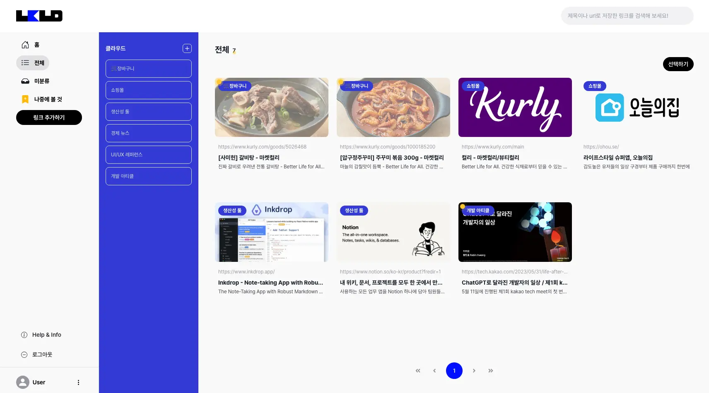

# **Linkloud**

링크를 간편하게 저장하고 관리할 수 있는 서비스

> Explore https://linkloud.xyz
#

#### 사람들이 링크를 저장하며 겪는 문제를 정의하고 이를 해결하기 위한 기능을 기획 및 개발
- 문제 1. 링크를 분류하지 않아 관리가 어렵다.
  - 카테고리를 만들어 링크를 분류할 수 있도록 기능 제공
- 문제 2. 어떤 링크인지 한눈에 알기 힘들다.
  - 메타태그를 기반으로 링크에 대한 정보를 자동으로 채워주는 기능을 제공
  - 링크를 쉽게 식별할 수 있도록 링크 별로 메타태그의 이미지를 미리 보기로 제공
  - 각 링크의 정보가 눈에 잘 들어올 수 있는 디자인
- 문제 3. 나중에 보려고 저장했는데 잊어버린다.
  - 확인하지 않은 링크가 눈에 띄도록 노란색 표시 UI를 제공하고, 확인한 링크는 불투명하게 처리하여 식별이 가능하도록 기능 제공
  - 확인하지 않은 링크를 모아놓은 “미확인" 메뉴를 제공
  - 미확인 링크를 골라 추천해 주는 “지금 읽을 만한 것” 섹션을 제공
- 문제 4. 저장한 링크가 쌓이면서 관리가 되지 않는다.
  - 오랫동안 확인하지 않은 링크를 알려주는 섹션을 제공
  - 확인했으나 이후 액션이 없는 링크를 알려주는 섹션을 제공
  - 위 섹션에서 각 링크에 링크를 확인하거나 제거할 수 있는 CTA 버튼을 함께 제공하여 관리를 위한 액션을 하도록 유도
